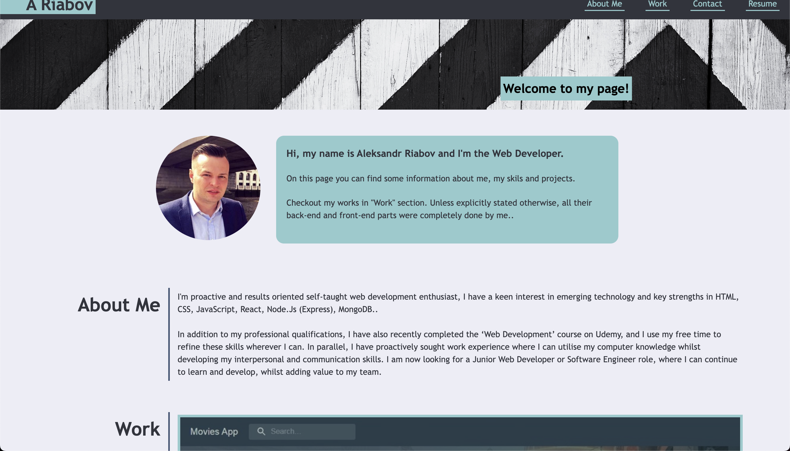

# Personal Portfolio WebPage

## Description 

This is repo with my portfolio web page source code. On the page, you can find some information about me, have a look at the projects I've created in the past and the stack of technologies I've used. Also, you can view my CV / Resume.

:point_right: [Go to Portfolio](https://aleksandrriabov.github.io/module-2-challenge/) :point_left:

## Installation
  1. Clone the repository.
  2. Navigate to cloned directory using '__cd module-2-challenge__' command.
  3. Open index.html file from terminal, using '__open index.html__' command.

## Screenshot

## Credits
[Aleksandr Riabov](https://github.com/AleksandrRiabov) :clap:

## Technologies used

